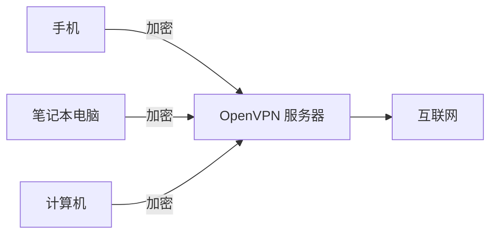

# openvpn-install 中文版

[](https://saythanks.io/to/angristan)

适用于 Debian, Ubuntu, Fedora, openSUSE, CentOS, Amazon Linux, Arch Linux, Oracle Linux, Rocky Linux 和 AlmaLinux 的 OpenVPN 安装器。

这个脚本可以让您在几秒钟内设置和管理自己的安全 VPN 服务器。

## 这是什么？

这个脚本旨在在您自己的服务器上运行，无论是 VPS、专用服务器，甚至是家用电脑。

设置完成后，您将能够为每个想要连接的设备生成客户端配置文件。

每个客户端都可以通过服务器路由其互联网流量，并且完全加密。



## 为什么选择 OpenVPN？

当这个脚本创建时，OpenVPN 是开源 VPN 的事实上的标准。WireGuard 后来出现，对于大多数用例来说更简单、更快。请查看 [wireguard-install](https://github.com/angristan/wireguard-install)。

也就是说，当您需要以下功能时，OpenVPN 仍然是有意义的：

- **TCP 支持**：在 UDP 被阻止的限制性环境中工作（企业网络、机场、酒店等）
- **密码保护的私钥**：WireGuard 配置以明文形式存储私钥
- **旧版兼容性**：客户端几乎适用于所有平台，包括较旧的系统

## 特性

- 安装并配置一个即用型 OpenVPN 服务器
- 用于自动化和脚本编写的 CLI 界面（带有 JSON 输出的非交互式模式）
- 客户端和服务器证书的证书续订功能
- 列出并监控已连接的客户端
- 证书吊销时立即断开客户端连接（通过管理界面）
- 尽可能使用 [官方 OpenVPN 仓库](https://community.openvpn.net/openvpn/wiki/OpenvpnSoftwareRepos) 获取最新稳定版本
- 防火墙规则和转发管理无缝（原生支持 firewalld 和 nftables，iptables 作为后备）
- 可配置的 VPN 子网（IPv4：默认 `10.8.0.0/24`，IPv6：默认 `fd42:42:42:42::/112`）
- 可配置的隧道 MTU（默认：`1500`）
- 如有需要，脚本可以干净地移除 OpenVPN，包括配置和防火墙规则
- 可自定义的加密设置，增强的默认设置（请参阅下方的 [安全性和加密](#security-and-encryption)）
- 尽可能使用最新的 OpenVPN 功能（请参阅下方的 [安全性和加密](#security-and-encryption)）
- 多种可推送给客户端的 DNS 解析器
- 选择使用带有 Unbound 的自托管解析器（支持已有的 Unbound 安装）
- 支持 TCP 和 UDP 协议选择
- 灵活的 IPv4/IPv6 支持：
  - IPv4 或 IPv6 服务器端点（客户端如何连接）
  - 仅 IPv4、仅 IPv6 或双栈客户端（VPN 寻址和互联网访问）
  - 支持所有组合：4→4, 4→4/6, 4→6, 6→4, 6→6, 6→4/6
  - 自动防止泄漏：在单栈模式下阻止不需要的协议
- 非特权模式：以 `nobody`/`nogroup` 身份运行
- 阻止 Windows 10 上的 DNS 泄漏
- 随机化的服务器证书名称
- 选择使用密码保护客户端（私钥加密）
- 允许多个设备同时使用同一个客户端配置文件的选项（禁用持久 IP 地址）
- **对等指纹认证**（OpenVPN 2.6+）：简化的类 WireGuard 认证，无需 CA
- 许多其他小功能！

## 兼容性

该脚本支持以下 Linux 发行版：

|                     | 支持 |
| ------------------- | ---- |
| AlmaLinux >= 8      | ✅ 🤖   |
| Amazon Linux 2023   | ✅ 🤖   |
| Arch Linux          | ✅ 🤖   |
| CentOS Stream >= 8  | ✅ 🤖   |
| Debian >= 11        | ✅ 🤖   |
| Fedora >= 40        | ✅ 🤖   |
| openSUSE Leap >= 16 | ✅ 🤖   |
| openSUSE Tumbleweed | ✅ 🤖   |
| Oracle Linux >= 8   | ✅ 🤖   |
| Rocky Linux >= 8    | ✅ 🤖   |
| Ubuntu >= 18.04     | ✅ 🤖   |

注意事项：

- 脚本仅针对标记有 🤖 的发行版进行定期测试。
  - 仅在 `amd64` 架构上测试过。
- 脚本需要 `systemd`。

### 推荐的提供商

- [Vultr](https://www.vultr.com/?ref=8948982-8H)：全球位置，支持 IPv6，起价 \$2.5/月
- [Hetzner](https://hetzner.cloud/?ref=ywtlvZsjgeDq)：全球位置，支持 IPv6，20 TB 流量，起价 €3.59/月
- [Digital Ocean](https://m.do.co/c/ed0ba143fe53)：全球位置，支持 IPv6，起价 \$4/月

## 使用方法

首先，在您的服务器上下载脚本并使其可执行：

```bash
curl -O https://raw.githubusercontent.com/plutobe/openvpn-install-zh/master/openvpn-install.sh
chmod +x openvpn-install.sh
```

您需要以root用户身份运行脚本，并启用TUN模块。

### 交互式模式

最简单的开始方式是使用交互式菜单：

```bash
./openvpn-install.sh interactive
```

这将引导您完成安装和客户端管理。

在您的主目录中，您将拥有 `.ovpn` 文件。这些是客户端配置文件。从服务器下载它们（例如使用 `scp`），并使用您喜欢的 OpenVPN 客户端连接。

如果您有任何问题，请先查看 [FAQ](#faq)。如果您需要帮助，可以打开一个 [讨论](https://github.com/angristan/openvpn-install/discussions)。请先搜索现有的问题和讨论。

### CLI 模式

> [!WARNING]
> 不保证 API 兼容性。版本之间可能会发生破坏性变更。如果您以编程方式使用此脚本（例如，在自动化或 CI/CD 中），请固定到特定提交，而不是使用 master 分支。

对于自动化和脚本编写，请使用 CLI 界面：

```bash
# 使用默认值安装
./openvpn-install.sh install

# 添加客户端
./openvpn-install.sh client add alice

# 列出客户端
./openvpn-install.sh client list

# 吊销客户端（如果已连接则立即断开）
./openvpn-install.sh client revoke alice
```

#### 命令

```text
openvpn-install <命令> [选项]

命令:
  install       安装并配置 OpenVPN 服务器
  uninstall     移除 OpenVPN 服务器
  client        管理客户端证书
  server        服务器管理
  interactive   启动交互式菜单

全局选项:
  --verbose     显示详细输出
  --log <路径>  日志文件路径（默认：openvpn-install.log）
  --no-log      禁用文件日志记录
  --no-color    禁用彩色输出
  -h, --help    显示帮助
```

运行 `./openvpn-install.sh <命令> --help` 获取命令特定的选项。

#### 客户端管理

```bash
# 添加新客户端
./openvpn-install.sh client add alice

# 添加受密码保护的客户端
./openvpn-install.sh client add bob --password

# 吊销客户端
./openvpn-install.sh client revoke alice

# 续订客户端证书
./openvpn-install.sh client renew bob --cert-days 365
```

列出所有客户端：

```text
$ ./openvpn-install.sh client list
══ 客户端证书 ══
[INFO] 找到 3 个客户端证书

   名称      状态      过期时间       剩余时间
   ----      ------   ---------      ---------
   alice     Valid    2035-01-15  3650 天
   bob       Valid    2035-01-15  3650 天
   charlie   Revoked  2035-01-15  未知
```

用于脚本编写的 JSON 输出：

```text
$ ./openvpn-install.sh client list --format json | jq
{
  "clients": [
    {
      "name": "alice",
      "status": "valid",
      "expiry": "2035-01-15",
      "days_remaining": 3650
    },
    {
      "name": "bob",
      "status": "valid",
      "expiry": "2035-01-15",
      "days_remaining": 3650
    },
    {
      "name": "charlie",
      "status": "revoked",
      "expiry": "2035-01-15",
      "days_remaining": null
    }
  ]
}
```

#### 服务器管理

```bash
# 续订服务器证书
./openvpn-install.sh server renew

# 卸载 OpenVPN
./openvpn-install.sh uninstall
```

显示已连接的客户端（数据每 60 秒刷新一次）：

```text
$ ./openvpn-install.sh server status
══ 已连接客户端 ══
[INFO] 找到 2 个已连接客户端

   名称    真实地址             VPN IP      连接时间         传输数据
   ----    ------------          ------      ---------------   --------
   alice   203.0.113.45:52341    10.8.0.2    2025-01-15 14:32  ↓1.2M ↑500K
   bob     198.51.100.22:41892   10.8.0.3    2025-01-15 09:15  ↓800K ↑200K

[INFO] 注意：数据每 60 秒刷新一次。
```

#### 安装选项

`install` 命令支持多种自定义选项：

```bash
# 自定义端口和协议
./openvpn-install.sh install --port 443 --protocol tcp

# 自定义 DNS 提供商
./openvpn-install.sh install --dns quad9

# 自定义加密设置
./openvpn-install.sh install --cipher AES-256-GCM --cert-type rsa --rsa-bits 4096

# 自定义 VPN 子网
./openvpn-install.sh install --subnet-ipv4 10.9.0.0

# 为客户端启用双栈（IPv4 + IPv6）
./openvpn-install.sh install --client-ipv4 --client-ipv6

# 仅 IPv6 客户端（无 IPv4）
./openvpn-install.sh install --no-client-ipv4 --client-ipv6

# IPv6 端点（服务器监听 IPv6，客户端通过 IPv6 连接）
./openvpn-install.sh install --endpoint-type 6 --endpoint 2001:db8::1

# 双栈设置的自定义 IPv6 子网
./openvpn-install.sh install --client-ipv6 --subnet-ipv6 fd00:1234:5678::

# 跳过初始客户端创建
./openvpn-install.sh install --no-client

# 带有多个选项的完整示例
./openvpn-install.sh install \
  --port 443 \
  --protocol tcp \
  --dns cloudflare \
  --cipher AES-256-GCM \
  --client mydevice \
  --client-cert-days 365
```

**网络选项：**

- `--endpoint <host>` - 客户端的公共 IP 或主机名（默认：自动检测）
- `--endpoint-type <4|6>` - 端点 IP 版本（默认：`4`）
- `--ip <addr>` - 服务器监听 IP（默认：自动检测）
- `--client-ipv4` - 为 VPN 客户端启用 IPv4（默认：启用）
- `--no-client-ipv4` - 为 VPN 客户端禁用 IPv4
- `--client-ipv6` - 为 VPN 客户端启用 IPv6（默认：禁用）
- `--no-client-ipv6` - 为 VPN 客户端禁用 IPv6
- `--subnet-ipv4 <x.x.x.0>` - IPv4 VPN 子网（默认：`10.8.0.0`）
- `--subnet-ipv6 <prefix>` - IPv6 VPN 子网（默认：`fd42:42:42:42::`）
- `--port <num>` - OpenVPN 端口（默认：`1194`）
- `--port-random` - 使用随机端口（49152-65535）
- `--protocol <udp|tcp>` - 协议（默认：`udp`）
- `--mtu <size>` - 隧道 MTU（默认：`1500`）

**DNS 选项：**

- `--dns <provider>` - DNS 提供商（默认：`cloudflare`）。选项：`system`, `unbound`, `cloudflare`, `quad9`, `quad9-uncensored`, `fdn`, `dnswatch`, `opendns`, `google`, `yandex`, `adguard`, `nextdns`, `custom`
- `--dns-primary <ip>` - 自定义主 DNS（需要 `--dns custom`）
- `--dns-secondary <ip>` - 自定义备用 DNS（需要 `--dns custom`）

**安全选项：**

- `--cipher <cipher>` - 数据加密算法（默认：`AES-128-GCM`）。选项：`AES-128-GCM`, `AES-192-GCM`, `AES-256-GCM`, `AES-128-CBC`, `AES-192-CBC`, `AES-256-CBC`, `CHACHA20-POLY1305`
- `--cert-type <ecdsa|rsa>` - 证书类型（默认：`ecdsa`）
- `--cert-curve <curve>` - ECDSA 曲线（默认：`prime256v1`）。选项：`prime256v1`, `secp384r1`, `secp521r1`
- `--rsa-bits <2048|3072|4096>` - RSA 密钥大小（默认：`2048`）
- `--hmac <alg>` - HMAC 算法（默认：`SHA256`）。选项：`SHA256`, `SHA384`, `SHA512`
- `--tls-sig <mode>` - TLS 模式（默认：`crypt-v2`）。选项：`crypt-v2`, `crypt`, `auth`
- `--auth-mode <mode>` - 认证模式（默认：`pki`）。选项：`pki`（基于 CA），`fingerprint`（对等指纹，需要 OpenVPN 2.6+）
- `--tls-version-min <1.2|1.3>` - 最低 TLS 版本（默认：`1.2`）
- `--tls-ciphersuites <list>` - TLS 1.3 密码套件，用冒号分隔（默认：`TLS_AES_256_GCM_SHA384:TLS_AES_128_GCM_SHA256:TLS_CHACHA20_POLY1305_SHA256`）
- `--tls-groups <list>` - 密钥交换组，用冒号分隔（默认：`X25519:prime256v1:secp384r1:secp521r1`）
- `--server-cert-days <n>` - 服务器证书有效期（天）（默认：`3650`）

**客户端选项：**

- `--client <name>` - 初始客户端名称（默认：`client`）
- `--client-password [pass]` - 密码保护客户端密钥（默认：无密码）
- `--client-cert-days <n>` - 客户端证书有效期（天）（默认：`3650`）
- `--no-client` - 跳过初始客户端创建

**其他选项：**

- `--multi-client` - 允许在多个设备上使用相同证书（默认：禁用）

#### 自动化示例

**批量创建客户端：**

```bash
#!/bin/bash
for user in alice bob charlie; do
  ./openvpn-install.sh client add "$user"
done
```

**从文件创建客户端：**

```bash
#!/bin/bash
while read -r user; do
  ./openvpn-install.sh client add "$user"
done < users.txt
```

**用于脚本编写的 JSON 输出：**

```bash
# 获取客户端列表（JSON 格式）
./openvpn-install.sh client list --format json | jq '.clients[] | select(.status == "valid")'

# 获取已连接客户端（JSON 格式）
./openvpn-install.sh server status --format json
```

## 分支说明

这个脚本基于 [Nyr 和其贡献者](https://github.com/Nyr/openvpn-install) 的出色工作。

自 2016 年以来，这两个脚本已经分道扬镳，不再相似，尤其是在底层实现上。该脚本的主要目标是增强安全性。但从那时起，该脚本已经完全重写，并添加了许多功能。不过，该脚本仅兼容较新的发行版，因此如果您需要使用非常旧的服务器或客户端，我建议使用 Nyr 的脚本。

## 常见问题 (FAQ)

更多问答请查看 [FAQ.md](FAQ.md)。

**问：** 您推荐哪个提供商？

**答：** 我推荐以下提供商：

- [Vultr](https://www.vultr.com/?ref=8948982-8H)：全球 locations，支持 IPv6，起价 \$2.5/月
- [Hetzner](https://hetzner.cloud/?ref=ywtlvZsjgeDq)：全球 locations，支持 IPv6，20 TB 流量，起价 €3.59/月
- [Digital Ocean](https://m.do.co/c/ed0ba143fe53)：全球 locations，支持 IPv6，起价 \$4/月

---

**问：** 您推荐哪个 OpenVPN 客户端？

**答：** 如果可能，建议使用官方的 OpenVPN 2.4 客户端。

- Windows：[官方 OpenVPN 社区客户端](https://openvpn.net/index.php/download/community-downloads.html)。
- Linux：来自您发行版的 `openvpn` 包。Debian/Ubuntu 基于的发行版有一个 [官方 APT 仓库](https://community.openvpn.net/openvpn/wiki/OpenvpnSoftwareRepos)。
- macOS：[Tunnelblick](https://tunnelblick.net/)、[Viscosity](https://www.sparklabs.com/viscosity/)、[OpenVPN for Mac](https://openvpn.net/client-connect-vpn-for-mac-os/)。
- Android：[OpenVPN for Android](https://play.google.com/store/apps/details?id=de.blinkt.openvpn)。
- iOS：[官方 OpenVPN Connect 客户端](https://itunes.apple.com/us/app/openvpn-connect/id590379981)。

---

**问：** 使用您的脚本，我能避开 NSA 的监控吗？

**答：** 请评估您的威胁模型。即使这个脚本考虑了安全性并使用了最先进的加密技术，如果您想躲避 NSA，VPN 可能不是您的最佳选择。

---

**问：** 有 OpenVPN 文档吗？

**答：** 是的，请查看 [OpenVPN 手册](https://openvpn.net/community-docs/community-articles/openvpn-2-6-manual.html)，其中包含所有选项的参考。

---

更多问答请查看 [FAQ.md](FAQ.md)。

## 贡献

### 讨论变更

如果您想讨论变更，特别是重大变更，请在提交 PR 前先打开一个 issue。

## 安全性和加密

> [!NOTE]
> 这个脚本创建于 2016 年，当时 OpenVPN 的默认设置相当薄弱。在那个时候，自定义加密设置对于安全的配置至关重要。从那时起，OpenVPN 已经显著改进了其默认设置，但该脚本仍然提供自定义选项。

OpenVPN 2.3 及更早版本使用过时的默认设置，如 Blowfish (BF-CBC)、TLS 1.0 和 SHA1。此后的每个主要版本都带来了显著的改进：

- **OpenVPN 2.4** (2016)：添加了 ECDSA、ECDH、AES-GCM、NCP（密码协商）和 tls-crypt
- **OpenVPN 2.5** (2020)：默认密码从 BF-CBC 更改为 AES-256-GCM:AES-128-GCM，添加了 ChaCha20-Poly1305、tls-crypt-v2 和 TLS 1.3 支持
- **OpenVPN 2.6** (2023)：默认最低 TLS 版本为 1.2，默认阻止压缩，用于无 PKI 设置的 `--peer-fingerprint`，以及 DCO 内核加速

如果您想了解更多关于以下提到的选项的信息，请查看 [OpenVPN 手册](https://community.openvpn.net/openvpn/wiki/Openvpn24ManPage)。它非常完整。

证书和 PKI 管理由 [Easy-RSA](https://github.com/OpenVPN/easy-rsa) 处理。默认参数位于 [vars.example](https://github.com/OpenVPN/easy-rsa/blob/v3.2.2/easyrsa3/vars.example) 文件中。

### 压缩

这个脚本曾经支持 LZ4 和 LZO 压缩算法，但由于 [VORACLE 攻击](https://community.openvpn.net/Security%20Announcements/VORACLE) 漏洞而不推荐使用它们。

OpenVPN 2.6+ 将 `--allow-compression` 默认为 `no`，甚至阻止服务器推送的压缩。现在 OpenVPN 正在完全移除压缩支持，因此这个脚本不再支持压缩。

### TLS 版本

> [!NOTE]
> OpenVPN 2.6+ 默认最低 TLS 版本为 1.2。之前的版本默认接受 TLS 1.0。

OpenVPN 2.5 及更早版本默认接受 TLS 1.0，该版本已有近 [20 年历史](https://en.wikipedia.org/wiki/Transport_Layer_Security#TLS_1.0)。

为了与所有 OpenVPN 2.4+ 客户端兼容，该脚本默认使用 `tls-version-min 1.2`。您可以选择将 `tls-version-min` 设置为 1.3，适用于所有客户端都支持 TLS 1.3 的环境。

OpenVPN 2.5 中添加了 **TLS 1.3 支持**，需要 OpenSSL 1.1.1+。TLS 1.3 提供了改进的安全性和性能，并采用了简化的握手过程。

脚本通过 `--tls-ciphersuites` 配置 TLS 1.3 密码套件（与 TLS 1.2 的 `--tls-cipher` 选项分开）。默认的 TLS 1.3 密码套件包括：

- `TLS_AES_256_GCM_SHA384`
- `TLS_AES_128_GCM_SHA256`
- `TLS_CHACHA20_POLY1305_SHA256`

OpenVPN 2.3.3 开始支持 TLS 1.2。OpenVPN 2.5 开始支持 TLS 1.3。

### 证书

OpenVPN 默认使用带有 2048 位密钥的 RSA 证书。

OpenVPN 2.4 添加了对 ECDSA 的支持。椭圆曲线密码学更快、更轻量、更安全。

该脚本提供：

- ECDSA：`prime256v1`/`secp384r1`/`secp521r1` 曲线
- RSA：`2048`/`3072`/`4096` 位密钥

它默认使用带有 `prime256v1` 曲线的 ECDSA。

OpenVPN 默认使用 `SHA-256` 作为签名哈希，脚本也是如此。目前它不提供其他选择。

### 认证模式

该脚本支持两种认证模式：

#### PKI 模式（默认）

传统的基于证书颁发机构（CA）的认证。服务器和所有客户端都有由同一个 CA 签名的证书。客户端吊销通过证书吊销列表（CRL）处理。

这是大型部署的推荐模式，当您需要：

- 集中式证书管理
- 基于标准 CRL 的吊销
- 与所有 OpenVPN 版本兼容

#### 对等指纹模式（OpenVPN 2.6+）

一种简化的类 WireGuard 认证模型，使用 SHA256 证书指纹而不是 CA 链。每个对等点（服务器和客户端）都有一个自签名证书，对等点通过验证指纹来相互认证。

```bash
# 使用指纹模式安装
./openvpn-install.sh install --auth-mode fingerprint
```

优势：

- 设置更简单：无需 CA 基础设施
- 更容易理解：类似于 SSH 的 `known_hosts` 模型
- 适合小型设置：家庭网络、实验室、小团队

工作原理：

1. 服务器生成自签名证书并存储其指纹
2. 每个客户端生成自签名证书
3. 客户端指纹被添加到服务器的 `<peer-fingerprint>` 块中
4. 客户端使用服务器的指纹验证服务器
5. 吊销操作从服务器配置中移除指纹（不需要 CRL）

权衡：吊销客户端需要重新加载 OpenVPN（指纹在 server.conf 中）。在 PKI 模式下，CRL 文件会在新连接时自动重新读取。

### 数据通道

> [!NOTE]
> OpenVPN 2.5 中默认数据通道密码发生了变化。之前的版本默认使用 `BF-CBC`，而 OpenVPN 2.5+ 默认使用 `AES-256-GCM:AES-128-GCM`。OpenVPN 2.6+ 在可用时还将 `CHACHA20-POLY1305` 包含在默认密码列表中。

默认情况下，OpenVPN 2.4 及更早版本使用 `BF-CBC` 作为数据通道密码。Blowfish 是一种古老（1993 年）且较弱的算法。即使是官方的 OpenVPN 文档也承认这一点。

> 默认值是 BF-CBC，即 Blowfish in Cipher Block Chaining 模式的缩写。
>
> 不再推荐使用 BF-CBC，因为它的块大小为 64 位。这种小的块大小允许基于碰撞的攻击，如 SWEET32 所演示的那样。有关详细信息，请参见 <https://community.openvpn.net/openvpn/wiki/SWEET32>。
> INRIA 的安全研究人员发表了一篇关于 64 位块密码（如 3DES 和 Blowfish）的攻击文章。他们表明，当相同的数据发送足够多次时，他们能够恢复明文，并展示了他们如何利用跨站点脚本漏洞发送足够多次的感兴趣数据。这适用于 HTTPS，也适用于 HTTP-over-OpenVPN。有关更好、更详细的解释，请参见 <https://sweet32.info/>。
>
> OpenVPN 的默认密码 BF-CBC 受到此攻击的影响。

确实，AES 是当今的标准。它是当今可用的最快、最安全的密码。[SEED](https://en.wikipedia.org/wiki/SEED) 和 [Camellia](<https://en.wikipedia.org/wiki/Camellia_(cipher)>) 到目前为止没有漏洞，但比 AES 慢，而且相对不太受信任。

> 在当前支持的密码中，OpenVPN 当前建议使用 AES-256-CBC 或 AES-128-CBC。OpenVPN 2.4 及更新版本还将支持 GCM。对于 2.4+，我们建议使用 AES-256-GCM 或 AES-128-GCM。

AES-256 比 AES-128 慢 40%，而且使用 256 位密钥而不是 128 位密钥的 AES 没有任何实际原因。（来源：[1](http://security.stackexchange.com/questions/14068/why-most-people-use-256-bit-encryption-instead-of-128-bit),[2](http://security.stackexchange.com/questions/6141/amount-of-simple-operations-that-is-safely-out-of-reach-for-all-humanity/6149#6149)）。此外，AES-256 更容易受到 [时序攻击](https://en.wikipedia.org/wiki/Timing_attack) 的影响。

AES-GCM 是一种 [AEAD 密码](https://en.wikipedia.org/wiki/Authenticated_encryption)，这意味着它同时提供对数据的保密性、完整性和真实性保证。

ChaCha20-Poly1305 是另一种提供与 AES-GCM 类似安全性的 AEAD 密码。它在没有硬件 AES 加速（AES-NI）的设备上特别有用，例如较旧的 CPU 和许多基于 ARM 的设备，在这些设备上它可以比 AES 快得多。

该脚本支持以下密码：

- `AES-128-GCM`
- `AES-192-GCM`
- `AES-256-GCM`
- `AES-128-CBC`
- `AES-192-CBC`
- `AES-256-CBC`
- `CHACHA20-POLY1305`（需要 OpenVPN 2.5+）

默认值为 `AES-128-GCM`。

OpenVPN 2.4 添加了一个称为 "NCP" 的功能：_Negotiable Crypto Parameters_（可协商加密参数）。这意味着您可以像 HTTPS 一样提供密码套件。默认设置为 `AES-256-GCM:AES-128-GCM`，当与 OpenVPN 2.4 客户端一起使用时，会覆盖 `--cipher` 参数。为了简单起见，脚本将 `--cipher`（非 NCP 客户端的回退）、`--data-ciphers`（现代 OpenVPN 2.5+ 命名）和 `--ncp-ciphers`（OpenVPN 2.4 兼容性的旧别名）设置为上面选择的密码。

### 控制通道

OpenVPN 2.4 默认会协商可用的最佳密码（例如 ECDHE+AES-256-GCM）

#### TLS 1.2 密码 (`--tls-cipher`)

根据证书，脚本提供以下选项：

- ECDSA：
  - `TLS-ECDHE-ECDSA-WITH-AES-128-GCM-SHA256`
  - `TLS-ECDHE-ECDSA-WITH-AES-256-GCM-SHA384`
  - `TLS-ECDHE-ECDSA-WITH-CHACHA20-POLY1305-SHA256`（需要 OpenVPN 2.5+）
- RSA：
  - `TLS-ECDHE-RSA-WITH-AES-128-GCM-SHA256`
  - `TLS-ECDHE-RSA-WITH-AES-256-GCM-SHA384`
  - `TLS-ECDHE-RSA-WITH-CHACHA20-POLY1305-SHA256`（需要 OpenVPN 2.5+）

默认值为 `TLS-ECDHE-*-WITH-AES-128-GCM-SHA256`。

#### TLS 1.3 密码 (`--tls-ciphersuites`)

当协商 TLS 1.3 时，使用一组单独的密码套件。这些通过 `--tls-ciphersuites` 配置，并使用 OpenSSL 命名约定：

- `TLS_AES_256_GCM_SHA384`
- `TLS_AES_128_GCM_SHA256`
- `TLS_CHACHA20_POLY1305_SHA256`

默认情况下，所有三个密码套件都已启用。TLS 1.3 密码套件更简单，因为它们不包括密钥交换算法（通过密钥共享单独协商）。

### 密钥交换

OpenVPN 历史上默认使用 2048 位 DH 参数进行密钥交换。该脚本曾经提供 DH（可配置密钥大小）和 ECDH 作为替代方案。

OpenVPN 2.4 添加了 ECDH 支持，OpenVPN 2.7 将 `dh none`（ECDH）设为默认值，因为有限域 DH 正在被弃用。由于 ECDH 现在得到普遍支持和首选，该脚本不再提供传统 DH。

脚本使用以下优先级列表配置 `tls-groups`：

```
X25519:prime256v1:secp384r1:secp521r1
```

- **X25519**：快速、现代的曲线（Curve25519），广泛支持
- **prime256v1**：NIST P-256，最兼容
- **secp384r1**：NIST P-384，更高安全性
- **secp521r1**：NIST P-521，最高安全性

您可以使用 `--tls-groups` 自定义此设置。

### HMAC 摘要算法

来自 OpenVPN wiki，关于 `--auth`：

> 使用消息摘要算法 alg 对数据通道数据包和（如果启用）tls-auth 控制通道数据包进行 HMAC 认证。（默认值为 SHA1）。HMAC 是一种常用的消息认证算法（MAC），它使用数据字符串、安全哈希算法和密钥来生成数字签名。
>
> 如果选择了 AEAD 密码模式（例如 GCM），则指定的 --auth 算法将被忽略，而是使用 AEAD 密码的认证方法。注意，alg 仍然指定用于 tls-auth 的摘要。

脚本提供以下选择：

- `SHA256`
- `SHA384`
- `SHA512`

默认值为 `SHA256`。

### `tls-auth`、`tls-crypt` 和 `tls-crypt-v2`

来自 OpenVPN wiki，关于 `tls-auth`：

> 在 TLS 控制通道之上添加额外的 HMAC 认证层，以减轻 DoS 攻击和对 TLS 堆栈的攻击。
>
> 简而言之，--tls-auth 在 OpenVPN 的 TCP/UDP 端口上启用了一种 "HMAC 防火墙"，其中带有不正确 HMAC 签名的 TLS 控制通道数据包可以立即被丢弃而无需响应。

关于 `tls-crypt`：

> 使用密钥文件中的密钥对所有控制通道数据包进行加密和认证。（有关更多背景信息，请参见 --tls-auth。）
>
> 加密（和认证）控制通道数据包：
>
> - 通过隐藏用于 TLS 连接的证书提供更多隐私，
> - 使识别 OpenVPN 流量变得更加困难，
> - 提供 "穷人版" 后量子安全性，针对永远不会知道预共享密钥的攻击者（即没有前向保密性）。

因此，两者都提供了额外的安全层并减轻了 DoS 攻击。它们不是 OpenVPN 的默认设置。

`tls-crypt` 是 OpenVPN 2.4 的功能，除了认证外还提供加密（与 `tls-auth` 不同）。它更注重隐私。

`tls-crypt-v2` 是 OpenVPN 2.5 的功能，它在 `tls-crypt` 的基础上使用 **每个客户端密钥** 而不是共享密钥。每个客户端都会收到一个从服务器密钥派生的唯一密钥。这提供了：

- **更好的安全性**：如果一个客户端密钥被泄露，其他客户端不受影响
- **更简单的密钥管理**：客户端密钥可以单独吊销，无需重新生成服务器密钥
- **可扩展性**：更适合具有许多客户端的大型部署

脚本支持所有三个选项：

- `tls-crypt-v2`（默认）：每个客户端密钥，提供更好的安全性
- `tls-crypt`：所有客户端共享密钥，与 OpenVPN 2.4+ 兼容
- `tls-auth`：仅 HMAC 认证（无加密），与旧客户端兼容

### 证书类型验证 (`remote-cert-tls`)

服务器配置了 `remote-cert-tls client`，这要求连接的对等点具有带有 "TLS Web Client Authentication" 扩展密钥用法的证书。这可以防止服务器证书被用来冒充客户端。

同样，客户端配置了 `remote-cert-tls server`，以确保它们只连接到呈现有效服务器证书的服务器。这可以防止拥有有效客户端证书的攻击者设置恶意服务器。

### 数据通道卸载 (DCO)

[数据通道卸载](https://openvpn.net/as-docs/openvpn-data-channel-offload.html) (DCO) 是一种内核加速功能，通过将数据通道加密/解密保持在内核空间，消除了每个数据包在用户空间和内核空间之间的昂贵上下文切换，从而显著提高了 OpenVPN 性能。

DCO 已合并到 Linux 内核 6.16（2025 年 4 月）中。

**要求：**

- OpenVPN 2.6.0 或更高版本
- Linux 内核 6.16+（内置）或 `ovpn-dco` 内核模块
- UDP 协议（不支持 TCP）
- AEAD 密码（`AES-128-GCM`、`AES-256-GCM` 或 `CHACHA20-POLY1305`）

脚本的默认设置（AES-128-GCM、UDP）与 DCO 兼容。当 DCO 可用且配置兼容时，OpenVPN 将自动使用它以提高性能。

**注意：** DCO 必须在服务器和客户端上都受支持才能实现完全加速。客户端支持可在 OpenVPN 2.6+（Linux、Windows、FreeBSD）和 OpenVPN Connect 3.4+（Windows）中获得。macOS 目前不支持 DCO，但客户端仍然可以连接到启用了 DCO 的服务器，并在服务器端获得部分性能优势。

脚本将在安装过程中显示 DCO 可用性状态。

## 表示感谢

如果您愿意，您可以 [表示感谢](https://saythanks.io/to/angristan)！

## 致谢和许可证

非常感谢 [贡献者](https://github.com/Angristan/OpenVPN-install/graphs/contributors) 和 Nyr 的原始工作。

该项目采用 [MIT 许可证](https://raw.githubusercontent.com/angristan/openvpn-install/master/LICENSE)

## 星标历史

[](https://star-history.com/#angristan/openvpn-install&Date)
